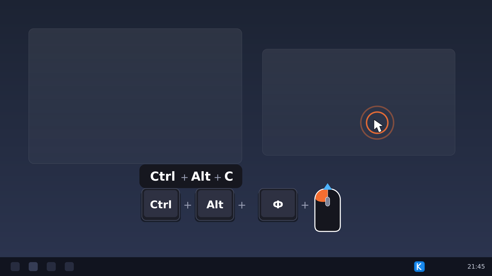

# keypress

[](https://github.com/danku13/keypress/actions/workflows/build.yml)
[](https://github.com/danku13/keypress/releases/latest)
[](README.md#быстрый-старт)
[](LICENSE)

Показывает на экране нажатия клавиш, кнопки мыши и прокрутку колесика —
для стримов, демонстраций и записи туториалов. Бесплатно (MIT), лёгкое,
с кириллицей из коробки.



<!--
Место для живой демонстрации: положи GIF в docs/demo.gif и замени
картинку выше на эту:


-->

**Содержание**: [Возможности](#возможности) · [Быстрый старт](#быстрый-старт) ·
[Горячие клавиши](#горячие-клавиши) · [Настройки](#настройки) ·
[Кастомные кейкапы](#кастомные-кейкапы) · [Оверлей над Пуском](#оверлей-над-меню-пуск-uiaccess-сборка) ·
[Для разработчиков](#для-разработчиков) · [Ограничения](#ограничения) ·
[Альтернативы](#альтернативы) · [Как это устроено](#как-это-устроено) · [Лицензия](#лицензия)

## Возможности

- **Комбо собираются** в «Ctrl + C»: одиночный модификатор показывается сам,
  автоповтор не спамит, до 10 строк истории
- **Кириллица**: на русской раскладке виджет показывает «Ф» вместо «A»
- **Мышь и колесо** в том же виджете: SVG-иконка с подсветкой нажатой кнопки,
  корректные смешанные комбо «Ctrl + ЛКМ», «Ctrl + Колесо ↓»
- **Режим кейкапов**: клавиши рисуются как [Ctrl] + [Alt] + [C] — вид сверху;
  можно назначить любую картинку-кейкап (общую и по-клавишные) и настроить
  позицию текста
- **Эффекты у курсора**: круг / кольцо / квадрат на клик + индикатор прокрутки
- **Иконка в трее**: статус, пауза/показ, настройки, выход — одним кликом
- **Всё настраивается на лету**: панель настроек и `keypress.toml` применяются
  без перезапуска

## Быстрый старт

1. Скачай `keypress-windows.zip` из
   [последнего релиза](https://github.com/danku13/keypress/releases/latest).
2. Распакуй и запусти `keypress.exe` (Windows 10/11, 64-бит). Windows может
   показать SmartScreen — бинарник не подписан: «Подробнее → Выполнить
   в любом случае».
3. Откроются **панель настроек и оверлей** — печатай и щёлкай, виджет появится
   внизу экрана. Тонкая настройка — в панели, применяется сразу.

Повторный запуск exe второй оверлей не создаст — просто покажет панель.
В панели есть кнопки «Запустить оверлей» / «Остановить оверлей» и статус.

Архивы по платформам собирает CI после каждого изменения; Linux/macOS-сборки —
заглушки (GUI работает только под Windows, см. [Для разработчиков](#для-разработчиков)).

## Горячие клавиши

| Действие | Кнопка |
|---|---|
| Пауза / показ виджета | `Ctrl+Alt+K` или ЛКМ по иконке в трее |
| Выход (закрывает и панель, и оверлей) | `Ctrl+Alt+Q` или ПКМ по иконке → «Выход» |
| Открыть настройки | двойной клик по иконке в трее |
| Меню трея | ПКМ по иконке: пауза (с галочкой), настройки, выход |

## Настройки

Хранятся в `keypress.toml`, применяются **на лету** (перезачитываются по mtime).
Порядок выбора места файла: переменная `KEYPRESS_CONFIG` → папка exe
(портативно) → `%APPDATA%\keypress\keypress.toml` (если папка exe не доступна
на запись, например UIAccess-установка в Program Files).

| Ключ | По умолчанию | Описание |
|---|---|---|
| `scale` | `1.0` | общий масштаб виджета и эффектов (0.5–3.0) |
| `pos_x` / `pos_y` | `0.5` / `0.92` | позиция виджета, доли экрана (0–1) |
| `show_keys` | `true` | показывать клавиши |
| `show_clicks` | `true` | показывать клики |
| `show_scroll` | `true` | показывать прокрутку |
| `show_cyrillic` | `true` | символы кириллической раскладки |
| `keycap_style` | `false` | режим кейкапов «вид сверху» |
| `mouse_icons` | `true` | мышь/колесо SVG-иконкой (иначе текстом) |
| `mouse_body` | `[0.08, 0.08, 0.10, 0.85]` | цвет корпуса мыши, RGBA 0–1 |
| `mouse_outline` | `[1.0, 1.0, 1.0, 1.0]` | цвет контура мыши |
| `keycap_height` | `1.0` | высота кейкапов (0.5–2.5) |
| `keycap_image` | `""` | общая картинка-кейкап, путь к файлу |
| `keycap_images` | `{}` | по-клавишные картинки: `"A" = "caps/a.png"` |
| `keycap_text_dx` / `keycap_text_dy` | `0.0` | сдвиг подписи на кейкапе, точки |
| `keycap_text_scale` | `1.0` | масштаб подписи (0.3–3.0) |
| `max_keys` | `4` | строк в виджете (1–10) |
| `tray_icon` | `true` | иконка в системном трее |
| `key_duration` | `1.2` | время показа комбо, сек (0.5–5.0) |
| `key_radius` | `10.0` | скругление клавиш (0–40) |
| `click_shape` | `"Ring"` | форма индикатора клика: `Circle`/`Ring`/`Square` |
| `key_bg` | `[0.08, 0.08, 0.10, 0.85]` | фон клавиш, RGBA 0–1 |
| `key_text` | `[1.0, 1.0, 1.0, 1.0]` | текст клавиш |
| `click_color` | `[1.0, 0.45, 0.20, 0.90]` | цвет кликов и подсветки кнопок |
| `scroll_color` | `[0.30, 0.70, 1.00, 0.90]` | цвет прокрутки |

Удобнее всего менять через панель настроек — она пишет тот же файл.

## Кастомные кейкапы

В панели настроек группа «Кейкапы»: путь к общей картинке-кейкапу и
по-клавишные картинки («Клавиша» = «Файл», регистр имени не важен).
Порядок разрешения для клавиши: точное имя в по-клавишных → то же без
учёта регистра → общая картинка → стандартный SVG-кейкап. Относительный
путь считается от папки с `keypress.toml`; картинка растягивается на
размер кейкапа (высота — слайдером «Высота кейкапа»), подпись рисуется
поверх картинки — размер и сдвиг настраиваются слайдерами «Текст на
кейкапе» (X вправо, Y вниз, в точках).

Пример блока в keypress.toml:

```toml
keycap_height = 1.2
keycap_image = "caps/base.png"           # общая для всех клавиш
keycap_text_dx = 0.0
keycap_text_dy = 2.0
keycap_text_scale = 0.9

[keycap_images]                           # перекрывают общую
"A" = "caps/a.png"
"Пробел" = "caps/space.png"
```

Поддерживаются PNG/JPG/GIF/BMP/ICO/SVG; замену файла на диске подхватывает
без перезапуска.

## Оверлей над меню Пуск (UIAccess-сборка)

Меню Пуск на Windows 11 живёт в защищённой shell-полосе z-порядка ВЫШЕ
обычных topmost-окон, поэтому обычная сборка под Пуском не видна. Процесс
с `uiAccess="true"` в манифесте получает собственную полосу выше полосы
оболочки (так работает osk.exe). Сборка такой версии — скрипт из папки
проекта в PowerShell **от имени администратора**:

```powershell
.\make-uiaccess.ps1
```

Он: собирает exe с манифестом (`KEYPRESS_UIACCESS=1 cargo build --release`,
вшивку манифеста делает build.rs через winresource), создаёт самодписанный
сертификат подписи кода и доверяет ему локально, подписывает exe и кладёт в
`C:\Program Files\keypress\` (требование Windows: uiAccess-exe должен быть
подписан и лежать в защищённой папке — иначе не запустится вовсе).
Обычная сборка манифест не вшивает и ведёт себя как раньше.

## Для разработчиков

Сборка из исходников (Windows: тулчейн MSVC + «Desktop development with C++»
из Visual Studio Build Tools):

```bat
cargo run --release                 :: оверлей + панель настроек
cargo run --release -- --settings   :: только панель настроек
cargo build --release               :: один exe -> target\release\keypress.exe
cargo test                          :: 99 unit-тестов, Windows не нужен
```

Подробности реализации и грабли Win32 — в [ARCHITECTURE.md](ARCHITECTURE.md).

CI ([.github/workflows/build.yml](.github/workflows/build.yml)): каждый пуш
в `main` и PR проверяется тестами и собирается на трёх платформах — архивы
в артефактах запуска Actions (`keypress-windows.zip`, `keypress-linux.tar.gz`,
`keypress-macos.tar.gz`); пуш тега `v*` создаёт GitHub Release с ними.
Багрепорты и PR — welcome.

## Ограничения

- Только основной монитор: события за его пределами не отрисовываются.
- Поверх exclusive-fullscreen игр виджет не виден (borderless / оконный — ок).
- Ввод в приложениях, запущенных от администратора, виден только если
  сама программа тоже запущена от администратора (UIPI).
- При выключенной настройке «Кириллица» имена клавиш всегда английские.
- Боковые кнопки мыши (X1/X2) в виджете не показываются.
- Позиция виджета задаётся процентами экрана, а не перетаскиванием мышью.

## Альтернативы

| Проект | Лицензия | Примечание |
|---|---|---|
| **keypress** | MIT | кириллица из коробки, кастомные кейкапы, трей, toml-конфиг |
| [keyviz](https://github.com/mulaRahul/keyviz) | GPL-3.0 | зрелый кроссплатформенный визуализатор |
| [Carnac](https://github.com/Code52/carnac) | MS-PL | классика, давно не развивается |
| [KeyCastr](https://github.com/keycastr/keycastr) | BSD-3-Clause | ветеран под macOS |
| [Keystro](https://keystro.app/) | проприетарная | коммерческий (freemium), источник идеи |

Выбирай под задачу: если нужен именно лёгкий MIT-инструмент под Windows
с кириллицей и без лишнего — это он.

## Как это устроено

Кратко: низкоуровневые хуки клавиатуры/мыши (ввод никогда не глотается),
прозрачное клик-тру окно на egui поверх всего, конфиг на toml с перечитыванием
на лету, иконка трея на голом `Shell_NotifyIconW`. Внутри было несколько
неочевидных ловушек Win32 (клик-тру без LAYERED, невидимые слоёные окна,
Пуск в защищённой полосе, премультиплицированная альфа пикера) — все разобраны
в [ARCHITECTURE.md](ARCHITECTURE.md).

## Вдохновение

Идея и референсы: [Keystro](https://keystro.app/), [keyviz](https://github.com/mulaRahul/keyviz),
[Carnac](https://github.com/Code52/carnac). SVG-иконки мыши — по мотивам
[freesvg.org](https://freesvg.org/). Иконка трея и кейкапы рисуются кодом.

## Лицензия

[MIT](LICENSE) — используй, меняй и встраивай свободно.
